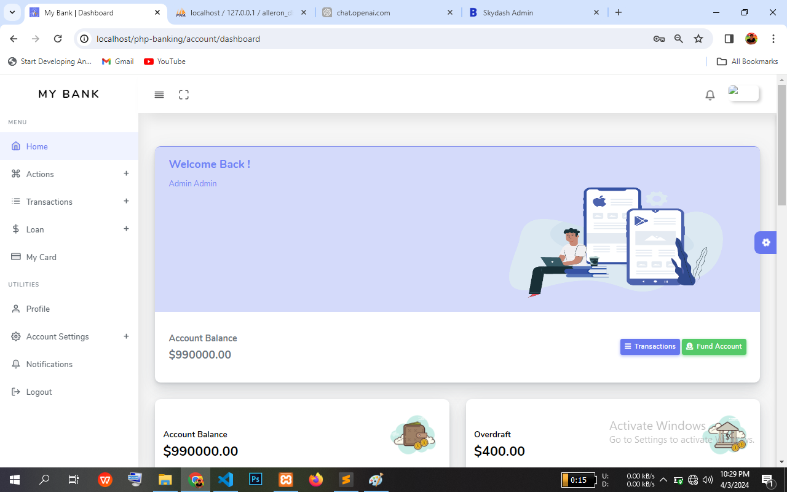
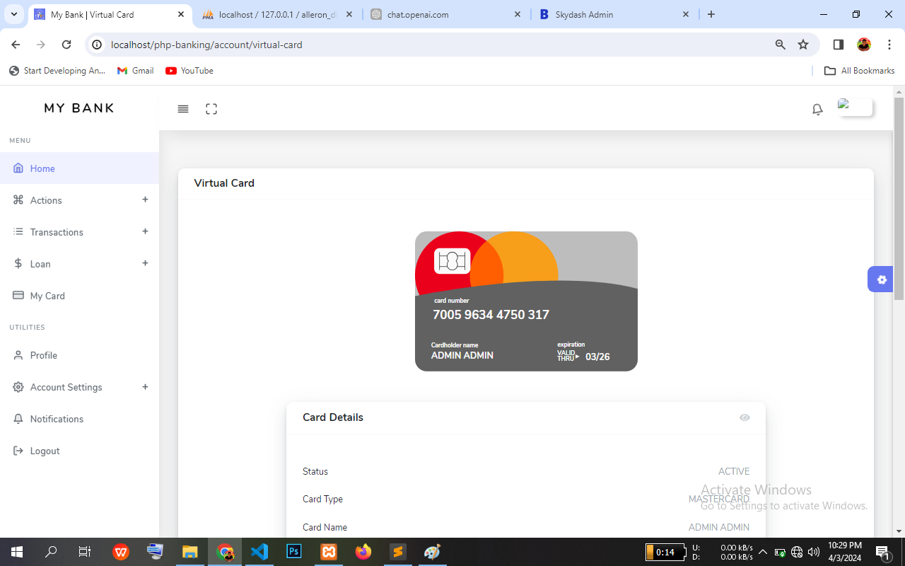
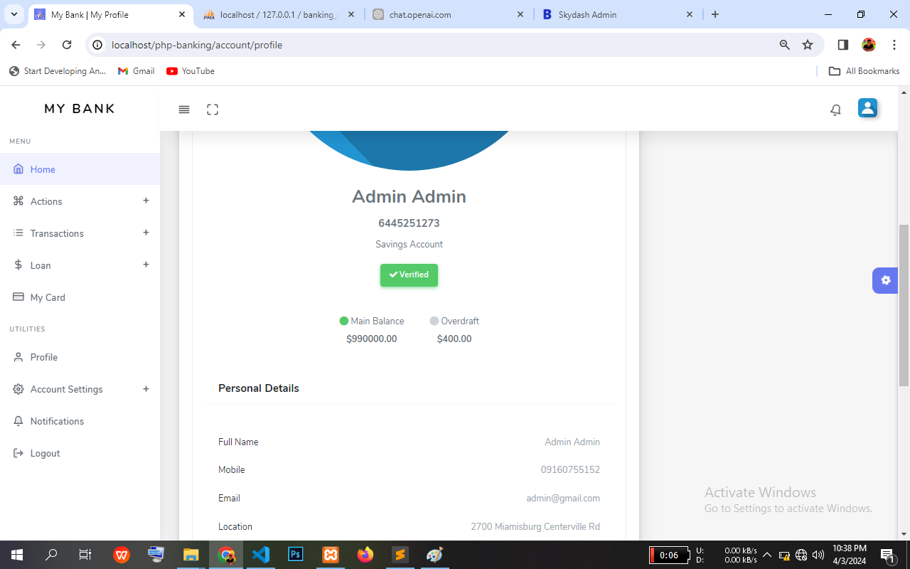
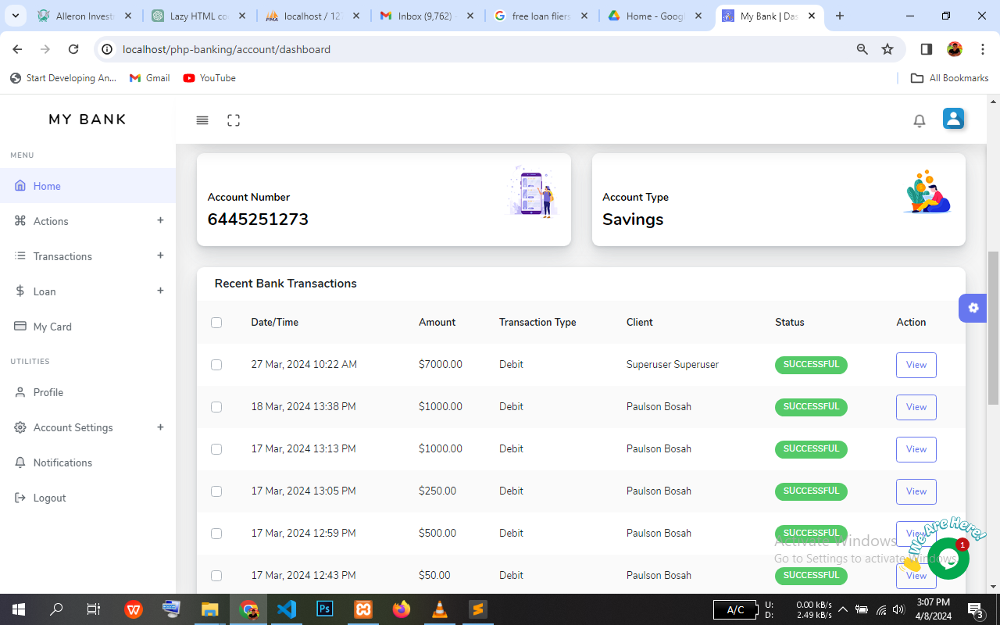

# About

This is a pseudo banking platform built with Javascript, AJAX and PHP that offers micro-banking solutions such as saving, transactions and loan services.

# Technical details

* Was implemented while imitating MVC structure where Controllers is separated from Views/Templates.

* 3 Interface - Landing, User Dashboard and Admin.

* Function to delete user notifications longer than 3 days was implemented using similar method to the investment function.

* A single function handles account credit and debit, saves the transaction record and sends appropriate notification

* Referral as implemented using javascript local storage. referrer was saved to local storage and fetched when user navigates to register/sign up page and deleted after successful registeration  

* Gets users location and timezone on sign up while converting transactions dates in UTC to dates in user's saved timezone

* Email uses html templates for nice and professional formatting

* Ajax and animations

# Features

* Emailing functionality
* Authentication and authorization
* Banking functionalities
* Loan application
* User blocking functionality
* User referral and commission program
* Ajax functionalities to communicate to backend without page reload
* Notification features and auto delete functionality
* Error pages - 404 implemented to handle errors
* Password reset functionality

# Technologies

* Vanilla Javascript
* Ajax
* PHP 8.2.4 (Xampp 8.2.0)
* PHPMailer v6.8.1
* Oitila template
* Otila Admin template

# Project shots

